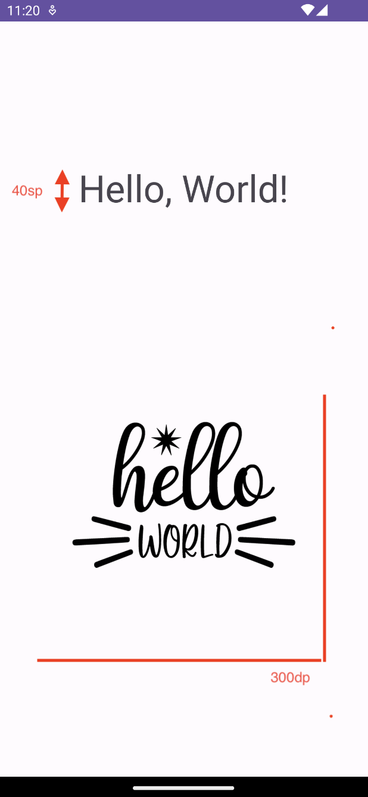
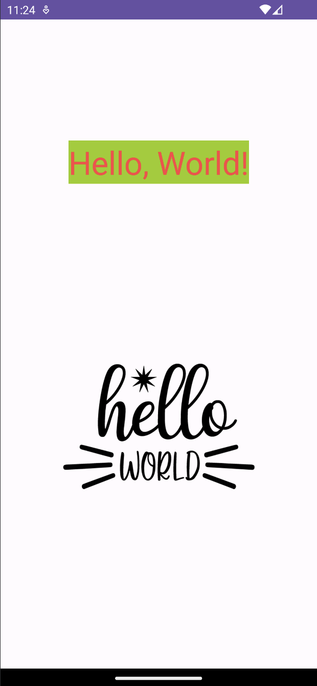
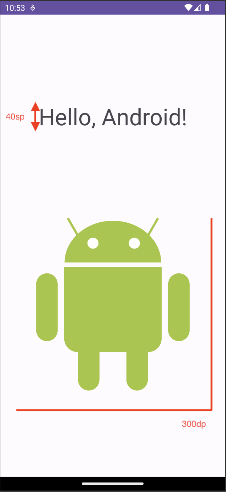

# Лабораторная работа №2. "Создание базового приложения. TextView и ImageView. Локализация"
## Создание базового приложения
1. Выполните fork репозитория  https://github.com/chebotarevsa/mad-2023-lab02
2. Выполните клонирование **своего** репозитория на локальную машину 
3. Создайте новый проект в Android Studio типа "Empty Views Activity"
  + Save location -  укажите путь к репозиторию. 
  + Language - Kotlin
  + Build configuration language - Kotlin DSL
4. Выполните сборку и запуск приложения

## TextView и ImageView. LinearLayout
1. Измените макет (layout) основной активности (Activity), чтобы он соответствовал следующему изображению

   
2. В качестве основного View Group используйте LinearLayout
3. Для ImageView используйте изображение [hello_world.png](img/hello_world.png)
4. Измените атрибуты TextView так, чтобы макет соответствовал следующему изображению

   
5. Все тексты, цвета и строки вынесите в файлы ресурсов

## TextView и ImageView. Векторные изображения. ConstraintLayout
1. Создайте новую активность (Activity).
2. Измените файл AndroidManifest.xml таким образом, чтобы новая активность использовалась при запуске приложения
3. Измените макет (layout) даной активности (Activity), чтобы он соответствовал следующему изображению

   
4. В качестве основного View Group используйте ConstraintLayout
5. Для ImageView используйте изображение [android.svg](img/android.svg)
6. Все тексты, цвета и строки вынесите в файлы ресурсов

## Динамическое создание View
1. Создайте новую активность (Activity).
2. Измените файл AndroidManifest.xml таким образом, чтобы новая активность использовалась при запуске приложения
3. Реализуйте динамическое отрисовку экрана (без использования layout) в теле данной активности таким образом,
   чтобы она соответствовала следующему изображению. Используйте LinearLayout

   

## Локализация
1. Выполните локализацию приложения на русский язык 

## Сдача работы
!!!! Срок сдачи работы до 18.10.2023
1. Выполните commit для фиксации всех изменений
2. Выполнить push для оправки изменений на github.com
3. Создайте Pull Request в репозиторий chebotarevsa/mad-2023-lab02.
  В названии Pull Request укажите группу и свою имя и фамилию, например "123 Иван Иванов"
